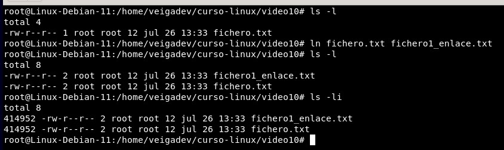
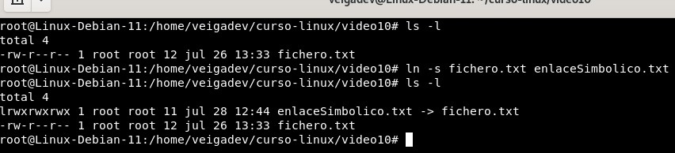

## INODOS Y ENLACES

### INODO
Se asigna un número de INODO a cada fichero creado de forma automatica
Un INODO tiene la inforamción de METADATOS del fichero
* Tamaño
* Dirección de datos
* Usuario
* Grupo
* etc. 

<table>
    <tr>
        <td colspan="2">INODOS Y ENLACES</td>
    </tr>
    <tr>
        <td colspan="2">Creación de links para acceder a una ruta del HDD</td>
    </tr>
    <tr>
        <td>ln "fichero" "nombre-link"</td>
        <td>Crear un link donde "nombre-link" apunto al INodo de "fichero"</td>
    </tr>
    <tr>
        <td>ls -li</td>
        <td>Nos muestra el numero de INodo de cada fichero</td>
    </tr>
    <tr>
        <td>ls -s "fichero" "linkSimbolico"</td>
        <td>Crean solo en enlace virtual apuntando al fichero</td>
    </tr>
</table>

### Enlace Hard
* ln nombreFichero.xxx nombreEnlaceHard.xxx
* Ahora tenemos un fichero y un enlance que apuntan al mismo INODO

### Enlace Soft o enlace virtual
* ln -s nombreFichero.xxx nombreEnlaceSoft.xxx
* Ahora tenemos un enlace virtual apuntado al fichero
