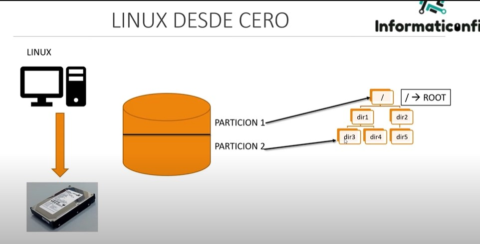
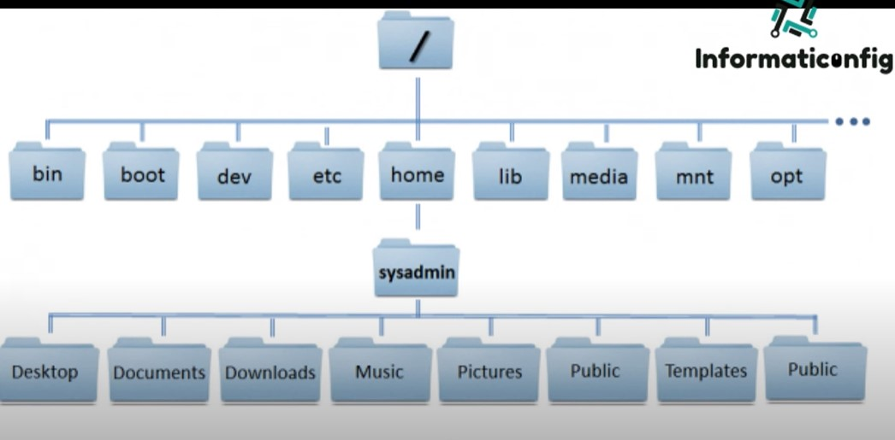
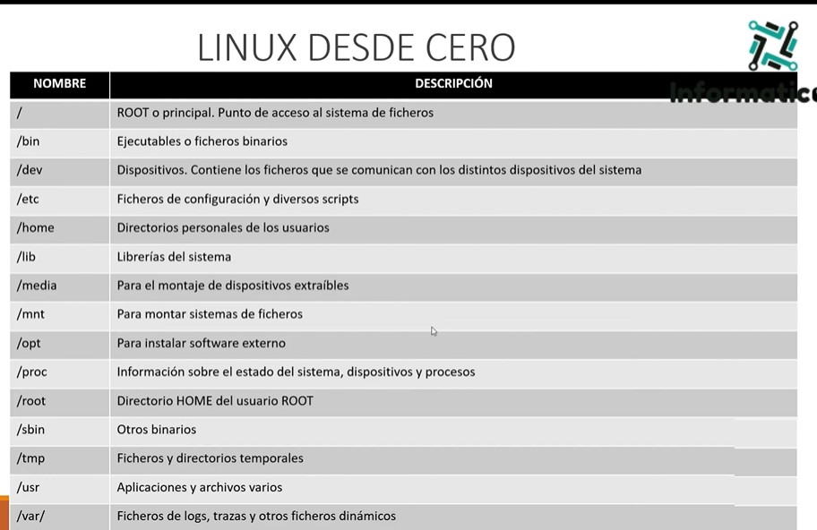

## EDITORES DE TEXTOS
Con los editores de texto podemos trabajar con la edición y modificación de Scripts.
Un Script es un fichero de texto que tienen comandos de Unix o Linus para que luego
sean ejecutados por el Shell.

El Shell se va a encargar de averiguar para quien fue escrito este Script.

### El Linux tenemos varios editores de texto
Es solo una herramienta de trabajo para el Administrador o Programador de Linux
- Vim
- new y max
- Sublime Text
- Atom
- Nano
- Gini
- Gedit ( Unos de los mas conocidos para Linux )
- Kate

### Tipos de Usuarios en Linux
En Linux tenemos 3 tipos de Usuarios

1. Usuario ROOT o Administrador
2. Usuarios NORMALES o de trabajo
3. Usuarios ESPECIALES o de sistema

Los usuarios tienen su propio directorio HOME.
Cada usuario tiene uan Shell para el acceso
Pertenecen al menos a 1 grupo

1. Usuario ROOT
- Tiene previlegios totales sobre el sistema.
- Su directorio habitualmente es /root
- Su identificador es 0 ( cero )
- No se recomienda trabajar con el usuario root, solo si es necesario realizar táreas
adminstrativos o de gestión del sistema
- Se accede con Password del sistema
- Su promt es: #

2. Usuarios NORMALES
- Se asignan a las personas o procesos que trabajan de forma habitual con Linux
- Son creados por el usuario root
- Su directorio suele ser /home.
- Sus ID suelen ser superior a 500 o a 1000. ( dependemos de la distribución de Linux )
- Acceden con Password
- Su promt es: $

3. Usuarios ESPECIALES
- Son para ejecutar diversos procesos en el sistema. Ej.: bin, deamon, adm, lp, sync
shutdown, mail, operator, squid, apache, etc.
- También son llamados cuentas del sistema
- Dependiendo de la cuenta tienen distintos previlegios de root
- No se pueden iniciar sesión en estas cuentas, no requieren contraseña.
- Se crean, por lo general, automáticamente al momento de la istalación de Linux o de 
la Aplicación.
- Suelen tener un ID entre 1 y 100

### Particiones en Linux
La partición se integra dentro de la estructura de directorios

### Directorios

### Contenido de los directorios instalados por defecto
