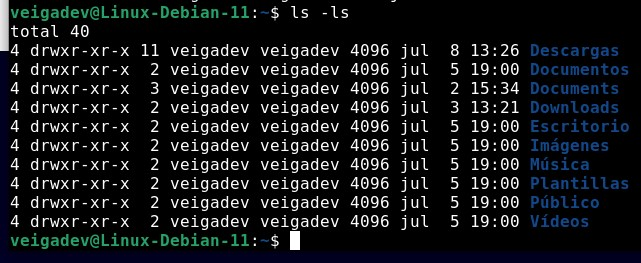

## COMANDOS III Y METACARACTERES


<table>
    <tr>
        <td colspan="2">COMANDOS III - METACARACTERES</td>
    </tr>
    <tr>
        <td colspan="2">cd /usr/bin</td>
    </tr>
    <tr>
        <td>Comando</td>
        <td>Función</td>
    </tr>
    <tr>
        <td>*</td>
        <td>Sustituye a todo un conjunto de ficheros o los nombres de un fichero</td>
    </tr>
    <tr>
        <td>ls b*</td>
        <td>Nos trae todos los ficheros que empiezan con "b"</td>
    </tr>
    <tr>
        <td>ls *ma*</td>
        <td>Trae los ficheros que contienen "ma" en su nombre</td>
    </tr>
    <tr>
        <td>ls *m*k*</td>
        <td>Trae los ficheros que contienen un "m" y una "k" en su nombre</td>
    </tr>
    <tr>
        <td>ls g?</td>
        <td>Trae los ficheros que empizan con "g" y tienen 1 caracter mas</td>
    </tr>
    <tr>
        <td>ls g??</td>
        <td>Trae los ficheros que empizan con "g" y tienen 2 caracter mas</td>
    </tr>
    <tr>
        <td>ls [afj]*</td>
        <td>Trae los ficheros que empiezan con "a" o "f" o "j"</td>
    </tr>
    <tr>
        <td>ls g*[0-9]</td>
        <td>Trae los ficheros que empiezan con "g" luego tenga cualquier cosa pero que terminene con 1 solo numero</td>
    </tr>
    <tr>
        <td>ls g*[0-9][0-9]</td>
        <td>Trae los ficheros que empiezan con "g" luego tenga cualquier cosa pero que terminene con 2 numeros</td>
    </tr>
    <tr>
        <td>file "nombre fichero"</td>
        <td>Nos dice el tipo de elemento que es</td>
    </tr>
</table>


```
drwxr-xr-x 11 4096 jul 8 13:26

Los primeros 9 caracteres identifican el tipo de permiso que tiene cada fichero

d ( empieza con d significa que es un directorio)
2 ( Es un directorio vacio)
11 ( tiene mas directorios adentro )

```
