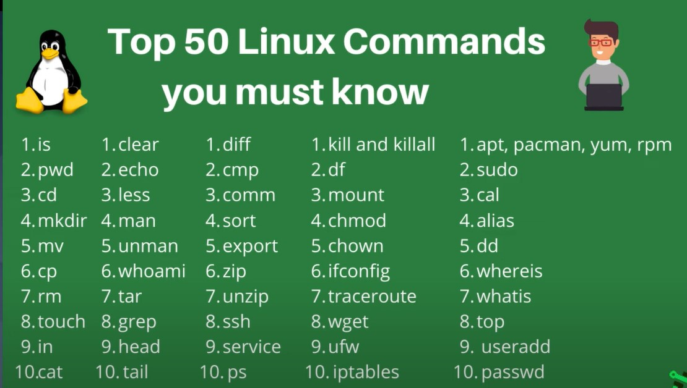
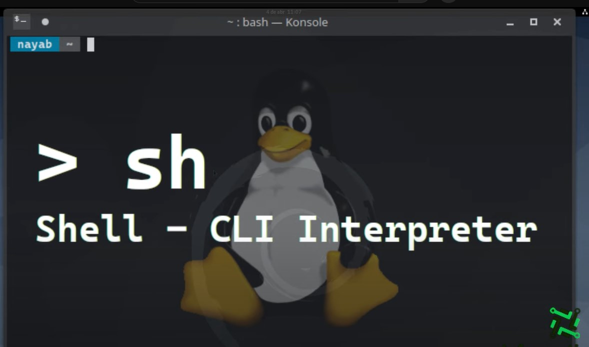

## COMANDOS I

### [Linux Documentation Commands](https://linux.die.net/)

- Interprete de Comandos ( Shell de Linux)
Es un programa que se ejecuta siempre que un usuario se conecta al sistema.
Su función principal es interactuar en entre el usuario.

### Comandos:
Linux es Key sensitive, vamos a poder esciribir un comando siempre que este el signo
(Dolar) en la terminal Shell.

- Ctrl + C = Cancela el comando en ejecución. 

- Comandos sin métodos y sin argumentos:
    * [who]
        -  Nos trae el usuario actual del sistema, el método de conexión que se esta
            usando y la fecha y hora
    * [clear]
        - Limpia la termainal.
    * [date]
        - Muestra la fecha y hora actual

- Comandos con argumentos
* [ping] <<argumento>>
    - > Ej.
    - > ping www.google.com
    - > ping 192.168.1.1
* [df -h]
    - Te muestra la configuración actual de las unidades de almacenamiento del sistema.
    Es un comando con un argumento (-h)
